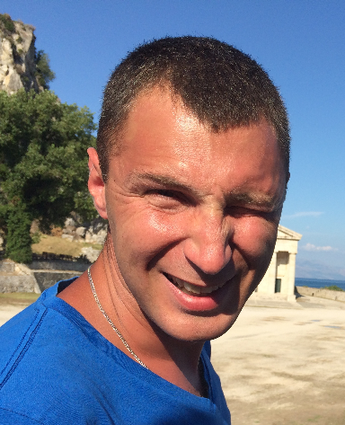

<slims01@tut.by> [+375 29 6079543](tel:+375296079543)

[About me](#aboutme) [Examples](#examples) [Projects](#projects) [Education](#education) [Languages](#languages)
# **Dzmitry Kavaleuski**
Junior designer


## **About me**
Currently, my main focus is learning new things and improving myself.
Highly Organized: Currently I am organizing the work of over 100 people.
Result-oriented: the key performance indicators of my department have increased by 9% this year.
I am always ready to learn new things and strive to be useful to the team and the people around me.
### **Skills**
I have basic skills in HTML, CSS, and I study JS
## **Examples of my code**
``` 
<>String.prototype.toJadenCase = function () {

var arr = this.split(" ");

for (var i = 0; i < arr.length; i++) {

arr[i] = arr[i][0].toUpperCase() + arr[i].slice(1);  

}

return arr.join(" ");

};
```

## **Projects**
I do not have any projects prepared at this time, but this will be fixed.
But on [GitHub](https://github.com/DikkinsonD/rsschool-cv.git) you can see what and how I am doing
## **Education**
I have a higher engineering education,
and also took advanced training courses in the direction of
Engineering of construction objects
## **Languages**
I estimate the level of knowledge of the English language as Beginner (A1) - Elementary (A2)

slims01@tut.by [+375 29 6079543](tel:+375296079543)